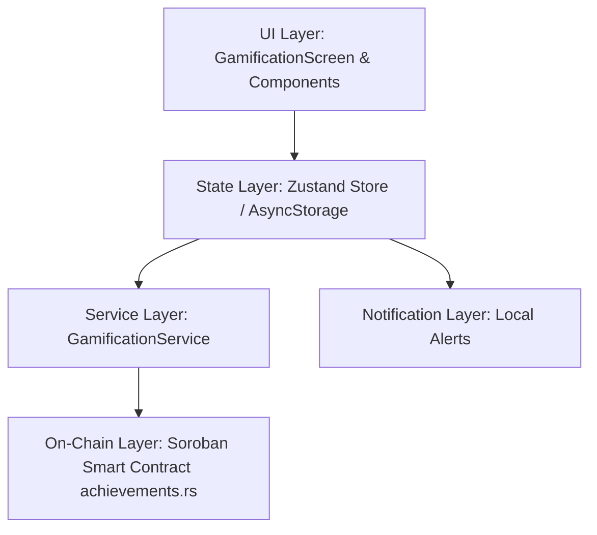

# SubTrackr Gamification System Guide

## Overview
The SubTrackr Gamification System is engineered to boost subscriber engagement and retention through interactive rewards, milestone achievements, dynamic leaderboards, and on-chain blockchain verification.

---

## 1. System Architecture

The gamification architecture consists of three integrated layers:



### Key Modules:
- **`src/types/gamification.ts`**: Core TypeScript interfaces for `Achievement`, `RewardDefinition`, `RewardItem`, `GamificationConfig`, `GamificationAnalytics`, and `LeaderboardEntry`.
- **`src/services/gamificationService.ts`**: Static definitions of achievements, badges, rewards catalog, multi-category leaderboard generators, and social sharing helpers.
- **`src/store/gamificationStore.ts`**: Zustand persistent store managing user points, levels, unlocked items, reward claims, and analytics calculations.
- **`contracts/subscription/src/achievements.rs`**: On-chain Stellar/Soroban smart contract module for decentralized recording and validation of unlocked milestones.

---

## 2. Achievement Triggers & Definitions

Achievements are evaluated whenever significant user actions occur, tracked via the `AchievementTrigger` enum:
- `SUBSCRIPTION_ADDED`: Adding new recurring subscriptions to the tracker.
- `CRYPTO_PAYMENT`: Settling subscription invoices using cryptocurrency.
- `SEGMENT_CREATED`: Categorizing subscriptions into custom analytical segments.
- `POINTS_MILESTONE`: Accumulating lifetime loyalty points.
- `STREAK_MILESTONE`: Maintaining consecutive on-time payment cycles without failures.
- `REFERRAL_MADE`: Inviting new merchants or users to SubTrackr.

### Sample Achievements & Rewards
| Achievement ID | Name | Criteria | XP Awarded | Reward Type | Reward Value |
|---|---|---|---|---|---|
| `first_sub` | Getting Started | Add 1 subscription | 50 XP | Loyalty Credit | 100 Credits |
| `tracker_pro` | Tracker Pro | Add 5 subscriptions | 200 XP | Discount Coupon | 10% Off (`PRO-10OFF`) |
| `crypto_pioneer` | Crypto Pioneer | Pay with crypto | 150 XP | Loyalty Credit | 500 Credits |
| `point_hoarder` | Point Hoarder | Earn 5,000 pts | 300 XP | Loyalty Credit | 1,000 Bonus Credits |
| `loyal_member` | Loyal Member | Earn 15,000 pts | 500 XP | VIP Discount | 20% Lifetime (`VIP-20OFF`) |
| `streak_master` | Streak Master | 30-charge streak | 200 XP | Discount Coupon | 15% Off (`STREAK-15OFF`) |
| `referral_pro` | Networker | Refer 5 friends | 250 XP | Ambassador Credit| 2,500 Credits |

---

## 3. Reward Distribution System

When `checkAchievements(trigger, metadata)` successfully unlocks an achievement:
1. **XP & Leveling**: Points are added to the user's total. If total points exceed `100 * (level ^ 1.5)`, a Level Up event fires.
2. **Badge Unlocking**: Any linked `badgeId` is unlocked and stored in `earnedBadges`.
3. **Reward Generation**: If the achievement defines a `reward`, a unique `RewardItem` is generated with coupon code prefixes or credit vouchers and placed in `earnedRewards`.
4. **Redemption Flow**: Users can view rewards in the **Rewards Catalog** tab, copy coupon codes directly to their device clipboard, claim loyalty credits, and mark coupons as redeemed after application.

---

## 4. Leaderboard & Social Sharing

### Multi-Category Leaderboards
The leaderboard system supports three interactive views:
- **All Time**: Ranked by cumulative XP earned across all actions.
- **Weekly**: Ranked by recent weekly XP acceleration.
- **Streaks**: Ranked by consecutive on-time charge days (`streak`).

### Social Sharing Integration
Using the React Native `Share` API, users can broadcast their progress:
- **Badge Share**: Share specific unlocked badges with custom emoji banners and hashtags (`#SubTrackr #Badges`).
- **Level Share**: Broadcast overall tracker level and XP to invite friends and build network density.

---

## 5. Gamification Analytics

The `getAnalytics()` method computes real-time engagement telemetry:
- **Completion Rate**: Percentage of available achievements unlocked (`0 - 100%`).
- **Category Breakdown**: Mapping of unlocked milestones across trigger types.
- **Points History**: Timestamped audit trail of up to 100 recent XP earnings and unlock reasons.

---

## 6. Store Configuration

Users have granular control over their gamification experience via `GamificationConfig`:
- `soundEffectsEnabled`: Toggle audio feedback on unlocks.
- `notificationsEnabled`: Enable/disable local alerts (`presentLocalNotification`).
- `showOnLeaderboard`: Toggle public display of username and rank on leaderboards.
- `dailyReminderEnabled`: Opt-in to daily push notifications to maintain payment streaks.

---

## 7. On-Chain Contract Integration (`achievements.rs`)

For enterprise and crypto-native users, achievement symbols are persisted to Stellar Soroban contract storage via `StorageKey::UserAchievements(Address)`.

### Rust Contract API:
```rust
/// Record an achievement unlock on-chain
pub fn record_achievement(env: &Env, storage: &Address, subscriber: &Address, achievement_id: Symbol) -> bool;

/// Query all earned achievement Symbols for a subscriber
pub fn get_earned_achievements(env: &Env, storage: &Address, subscriber: &Address) -> Vec<Symbol>;

/// Check whether an achievement is unlocked on-chain
pub fn has_achievement(env: &Env, storage: &Address, subscriber: &Address, achievement_id: Symbol) -> bool;
```

---

## 8. Testing & Quality Gates

The gamification module is covered by unit and integration tests that run as part of the regular Jest suite:

### Unit Tests
- **`src/store/__tests__/gamificationStore.test.ts`** — store behavior: points/leveling, level-up notifications (and suppression via config), reward claim/redeem, analytics, progress reset, history cap, and every achievement trigger (`SUBSCRIPTION_ADDED`, `CRYPTO_PAYMENT`, `SEGMENT_CREATED`, `POINTS_MILESTONE`, `STREAK_MILESTONE`, `REFERRAL_MADE`) including criteria-not-met and no-duplicate-unlock cases.
- **`src/services/__tests__/gamificationService.test.ts`** — service catalog: achievements/badges lookup, leaderboard generation for all categories (plus default category and zero-streak edge cases), and social sharing success/error paths.

### Integration Tests (critical paths)
- **`src/store/__tests__/integration.test.ts`** — verifies the cross-store wiring with a real in-memory AsyncStorage:
  - `addSubscription` awards XP and unlocks the `first_sub` achievement with its credit reward.
  - Adding a high-value subscription unlocks `high_roller`.
  - Adding five subscriptions unlocks `tracker_pro` with the `PRO-10OFF` discount reward.
  - Repeated adds never double-award an achievement.
  - `addSegment` (segment store) unlocks the `segmenter` achievement.

### Coverage & CI
- `gamificationStore.ts`: 100% statement/line coverage.
- `gamificationService.ts`: 100% statement/line coverage (≥80% branch).
- Run locally with:
  ```bash
  npx jest src/store/__tests__/gamificationStore.test.ts src/services/__tests__/gamificationService.test.ts src/store/__tests__/integration.test.ts
  ```
- The module is lint- and format-clean (`npm run lint`, `npm run format:check`).
