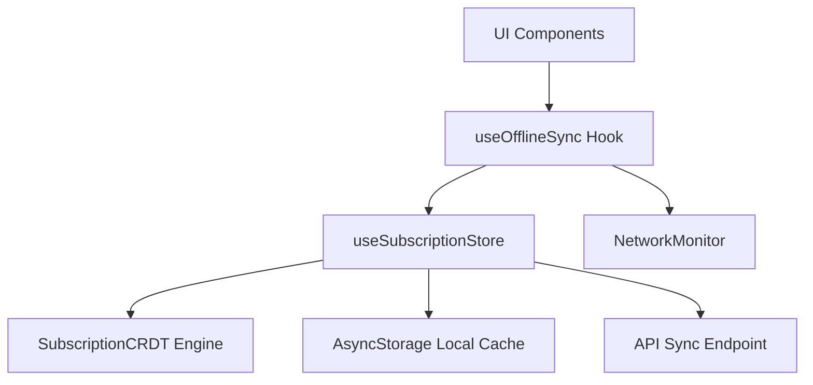

# Offline-First Subscription Sync Architecture

SubTrackr uses an offline-first data synchronization model to ensure the app remains fully functional (read and write) when network connectivity is lost, with automatic background synchronization and deterministic conflict resolution on network recovery.

## Core Components

### 1. NetworkMonitor (`src/services/network/networkMonitor.ts`)
Uses `@react-native-community/netinfo` to actively monitor connectivity. Provides:
- Synchronous query of online state (`isOnline()`).
- Event listeners notifying subscribers when connection status changes.

### 2. SubscriptionCRDT (`src/services/cache/crdt.ts`)
Implements a state-based CRDT merging strategy using:
- **Last-Write-Wins-Register (LWW-Register)**: Every field of a subscription has an associated modification epoch timestamp. During a merge, the higher timestamp wins.
- **LWW-Element-Set**: Deletions are tracked using a `deletedAt` tombstone timestamp. If a subscription has `deletedAt >= max(timestamps)`, it is considered deleted.
This satisfies commutative, associative, and idempotent mathematical properties, ensuring all devices converge to the exact same state regardless of sync order or failure retries.

### 3. Subscription Store (`src/store/subscriptionStore.ts`)
Manages Zustand state integrating CRDT metadata and persistence.
- Persists both subscriptions and their CRDT metadata locally via `AsyncStorage` debounced writes.
- Tracks `syncStatus`: `'idle' | 'pending' | 'syncing' | 'conflict' | 'error'`.
- Intercepts mutations (`addSubscription`, `updateSubscription`, `deleteSubscription`, `toggleSubscriptionStatus`) to:
  1. Modify local data instantly.
  2. Set field timestamps in `crdtMetadata`.
  3. Mark `syncStatus` as `pending`.
  4. Trigger background sync immediately if online.

### 4. useOfflineSync Hook (`src/hooks/useOfflineSync.ts`)
- Subscribes to `networkMonitor`.
- Automatically triggers a store sync when network transitions from offline to online.
- Employs **exponential backoff** for retries on failed sync attempts (starting at 1s, doubling up to a maximum of 60s) to prevent overloading the server or burning mobile data/battery.

## Sync Guarantees

1. **Idempotency**: Retrying a sync operation multiple times yields the exact same merged state.
2. **Deterministic Merging**: If device A and device B make concurrent modifications offline, merging their states on recovery yields a deterministic result:
   - If they modified different fields, the fields are merged.
   - If they modified the same field, the latest change (latest timestamp) wins.
   - If one deleted the subscription and the other updated it, the deletion wins unless the update timestamp is strictly greater than the deletion tombstone timestamp.
3. **No Message Ordering Reliance**: The state is synchronized as a whole CRDT payload. Packet loss, duplicates, or out-of-order packets do not impact final consistency.
